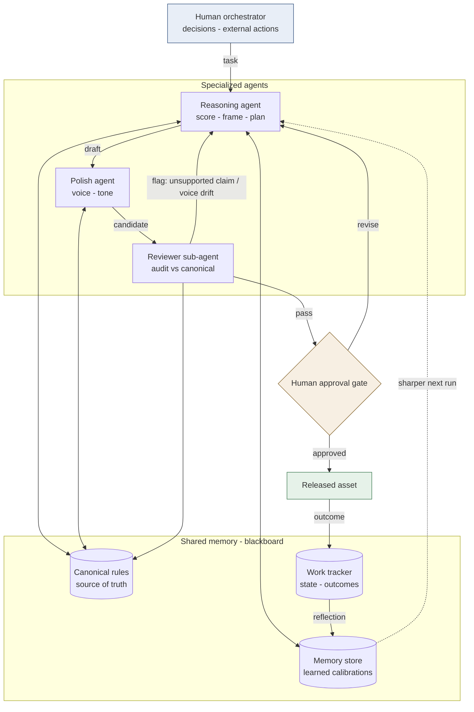

# Human-in-the-Loop Multi-Agent Operations System

A governed multi-agent architecture for marketing content operations and other evidence-sensitive document workflows — using shared-memory coordination, evaluator-optimizer review, explicit source authority, and human approval.

> **Scope of this repository.** This repository documents the architecture of a working personal operations system. The public version contains the design, coordination model, evaluation controls, and human-approval boundaries. It does not currently include a runnable implementation or execution trace.

This is a **reference architecture and operating-system case study** — not a productized framework, not a reference implementation, and not an autonomous agent.

---

## Why Content Operations Need Governance

GenAI makes content volume easy. The harder problem is keeping every output grounded in **approved product facts, brand rules, and explicit can't-claim boundaries.**

At volume, two failures show up on schedule:

- **Drift.** Asset 40 is not asset 1. Deviations compound quietly, and nobody notices until something off-brand or unsupported has already gone out.
- **No memory.** Each run starts cold, so the same corrections get made again.

Neither is a model problem, and neither is fixed by a better prompt. Both are coordination problems. What fixes them is a **canonical source of truth**, an **evaluator loop** that audits every asset against it before a human sees it, and a **reflection loop** that writes what was learned back to memory.

## Architecture

**Reading the diagram.** Arrows between stages represent **workflow transitions through shared work artifacts**, not direct peer-to-peer agent conversations. Agents do not message each other — each reads and writes the blackboard, so state lives in artifacts rather than in a conversation thread. Adding or swapping an agent requires only respecting the shared contract.

**In marketing terms:** the *canonical rules* are the approved-claims and brand-voice source of truth. The *reasoning agent* decides segment and angle. The *polish agent* writes to voice. The *reviewer* runs claim and voice review on every asset, not a sample. The *human gate* is the approver who would have signed off anyway — now reviewing pre-validated work instead of raw drafts.

## The Two Loops

**1. Claim governance (quality).** Before any asset reaches a human, the reviewer audits it against the canonical layer on three dimensions:

- **Claim integrity** — factual claims trace to approved sources.
- **Voice fidelity** — content follows approved brand and audience guidance.
- **Boundary enforcement** — prohibited or unsupported claims are explicitly blocked. The canonical layer carries can't-claim rules, not only approved facts; knowing what must *not* be said is the part naive systems miss.

On a flag, the asset returns to the creator with the specific line at issue and the loop repeats. Quality never depends on any single generation being correct.

This architecture can support — but never replace — the review chain used by many marketing organizations, including product-claim validation, legal review, brand review, and stakeholder approval.

**2. Human-approved reflection (learning).** Outcomes surface *proposed* calibrations. A human reviews and approves each one before it is written to memory; the next run anchors on the sharpened rules. **The system does not rewrite its own constraints** — proposing a rule change and adopting one are deliberately separate steps, because a system that silently edits its own source of truth cannot be audited.

The second loop is what separates this from a prompt chain. Without it, a multi-agent system is just more expensive inference.

## Where This Applies

Marketing content operations is the primary use case, not the architectural boundary. The architecture does not change across these — only the contents of the canonical layer do.

| Use case | What the canonical layer holds |
|---|---|
| Lifecycle and CRM content across segments | Brand voice, offer rules, approved product facts |
| Regional or vertical launch briefs from one product truth | Positioning, approved claims, localization boundaries |
| Sales enablement and partner collateral | Battlecard facts, competitive claims, cleared language |
| Personalized outreach and ABM | Persona messaging, substantiated proof points |

The same shape covers RFP and proposal response, and any workflow where output must trace to an approved source.

## Illustrative Walkthrough

*Illustrative walkthrough — not an execution trace.* Producing regional launch briefs from a single canonical product truth:

1. **Canonical** holds approved product facts, positioning, brand voice, competitive claim boundaries, and localization rules.
2. **Reasoning agent** scores the region, selects angle and proof points, plans the brief.
3. **Polish agent** drafts to brand voice for that market.
4. **Reviewer** would flag a performance claim not supported by the approved fact set, and a competitive comparison crossing a can't-claim boundary.
5. **Loop:** creator revises against the specific flags. Re-audit. Pass.
6. **Human gate** approves for release.
7. **Outcome** writes to the tracker; the resulting calibration sharpens angle selection for the next region.

Step 4 is the one that matters. A single-prompt workflow has no systematic control to flag that unsupported claim before human review.

<strong>Design patterns (mapped to Anthropic's <em>Building Effective Agents</em>)</strong>

 

| Mechanism in this system | Pattern |
|---|---|
| Creator drafts → reviewer audits against canonical → loop until pass | **Evaluator-optimizer** (generator-critic) |
| Reasoning agent → polish agent → review, in sequence | **Prompt chaining** with a quality gate |
| Task type routed to the appropriate specialized agent | **Routing** |
| Outcomes → proposed calibrations → human approval → memory | **Human-approved reflection loop** |
| Human confirms every rule change; a drift canary flags silent deviation | **Human-in-the-loop guardrails** |

**A note on what this is not.** Anthropic's taxonomy distinguishes *predefined workflows* from *agents that dynamically control their own process*. This system is the former: the stages are predefined, and the reasoning agent does not dynamically decompose work into variable subtasks. It is a **predefined agentic workflow with a spawned reviewer**, not an orchestrator-workers pattern. The distinction matters, and claiming the more autonomous pattern would misrepresent the design.

## What This Demonstrates

- Multi-agent orchestration and role specialization
- Shared-memory (blackboard) coordination design
- Claim integrity, voice fidelity, and boundary enforcement as a gate rather than a spot check
- Evaluator-optimizer quality loops for generative output
- Reflection loops grounded in a canonical source of truth
- Deliberate human-in-the-loop design at the points where errors are expensive

## Honest Scope

This is a reference architecture drawn from one working system, published to show design thinking. There is no throughput, quality, or claim-accuracy metric here, because a single-operator system is not evidence for any of them.

What it illustrates is the coordination and evaluation layer, which is where real agent deployments tend to struggle. That layer is the point.

**Deliberately not here yet:** a runnable implementation and an execution trace. Both are planned. When they land, the trace will be captured from an actual run — including a genuine failed review and revision — rather than hand-authored to resemble agent output. An artifact that only *looks* like a system run is worth less than no artifact at all.

## Operating Notes

Failure analyses from running the system: what broke, what the mechanism turned out to be, and what would prove each conclusion wrong. They document how the coordination and evaluation layer failed in practice, and which gates now exist because of it. They complement — but do not replace — the planned execution trace described above.

**[Read the operating notes →](./docs/operating-notes/)**

## Method Notes

Measurement contracts for selective workflows: what must be counted, which denominator makes a comparison valid, and what evidence would change the operating decision. The series covers source density and scoring validation.

**[Read the method notes →](./docs/method-notes/)**

## Provenance

Built and operated as a real working system for high-volume personalized-document production, then abstracted for publication. All domain specifics, private data, and third-party names have been removed; what remains is the architecture.

## License

MIT
